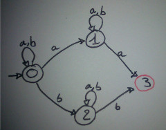
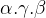

#AF4

### 1) Determinisation :
L'état **Initial** est un état qui possède tous les numéros des états initiaux de l'automate

Les états **finaux** sont les états qui ont **au moins un** numéro d'un état final de l'automate

| Etat | a | b |
|:--|:--:|:--:|
| 0 | 0,1 | 0,2 |
| 1 | 1,**3** | 1 |
| 2 | 2 | 2,**3**|
| **3** | **/** | **/** |

 

### 2) Automate Fini Complet Deterministe
Pour tansformer un AFD en un AFCD il faut ajouter un état "Poubelle" vers qui toutes les transitions manquante des autres états vont pointer

### 3) Complémentaire
**L'automate doit être complet.**
Tout les états finaux deviennent non-finaux et invrsement.

### 4) Mirroir
inverse transitions
initiaux -> terminaux
terminaux -> initiaux
### 5) Union
### 6) Inter

### 7) Moore
#### Minimisation d'un Automate

| Etat | 1 | 2 | 3 | 4 | 5 | 6 | 7 |
|:--:|:--:|:--:|:--|:--:|:--:|:--|:--:|
| Groupe | 0 | 0 | 0 | 0 | 0 | 1 | 1 |
| T | 1 0 | 1 0 | 0 1 | 0 1 | 0 1 | 1 0 | 1 0 |

| Groupe | 0 | 0 | 2 | 2 | 2 | 1 | 1 |
|:--:|:--:|:--:|:--|:--:|:--:|:--|:--:|
| T | 1 0 | 1 0 | 0 1 | **2** 1 | **2** 1 | 1 **2** | 1 **2** |

| Groupe | 0 | 0 | 3 | 2 | 2 | 1 | 1 |
|:--:|:--:|:--:|:--|:--:|:--:|:--|:--:|
| T | 1 0 | 1 0 | 0 1 | **3** 1 | 2 1 | 1 2 | 1 2 |

| Groupe | 0 | 0 | 3 | 2 | 4 | 1 | 1 |
|:--:|:--:|:--:|:--|:--:|:--:|:--|:--:|
| T | 1 0 | 1 0 | 0 1 | 3 1 | 2 1 | 1 **4** | 1 **4** |

### 8) Mc Naughton et Yamada
#### Contruire une expression rationnelle à partir d'un automate
  **Règle de suppresion d'un état**

##### Soit `A` l'automate suivant:

* On ajoute a l'automate un état `I` initial auquel on ajoute des epsilon transition vers les états initiaux
  et un état `F` Final ver qui vont pointer tout les états finaux avec des épsilon transitions

  
* Suppression de l'état `2`  
  
* Suppression de l'état `0`  
  
* Suppression de l'état `1`  
  

### 9) Équation linéaire droite
#### Contruire une expression rationnelle à partir d'un automate

#### Lemme d'Arden

_`L = X.L+Y   =>    L = X*.Y`_
==

**Lautomate doit être deterministe**

`L0 = a.L0 + a.L1 + ε`  
`L1 = b.L1 + b.L2`  
`L2 = a.L2 + a.L3`  
`L3 = b.L3 + b.L0`

**On ne cherche que les états initiaux. S'il y a plusieurs états initiaux on fera l'union**

`L3 = b*.(b.L0)`  Lemme d'Arden

On remplace `L3` dans `L2`  
`L2 = a.L2 + a.b*.(b.L0)`  

Il nous reste donc :  
`L0 = a.L0 + a.L1 + ε`  
`L1 = b.L1 + b.L2`  
`L2 = a.L2 + a.b*.(b.L0)`  

`L2 = a*.a.b*.b.L0` => (Arden)

`L0 = a.L0 + a.L1 + ε`  
`L1 = b.L1 + b.a*.a.b*.b.L0`

`L1 = b*.b.a*.a.b*.b.L0` => (Arden)

`L0 = a.L0 + a.b*.b.a*.a.b*.b.L0 + ε`  
`L0 = (a.+ a.b*.b.a*.a.b*.b).L0 + ε`  

`L0 = (a.+ a.b*.b.a*.a.b*.b)*`  => (Arden)

### 10) Résiduel

`L = b.(a.a)*.b.a.(b.b)*.b`

|État | |Expression|
|:--     |:--|:--|
|0|`L =`|` b.(a.a)*.b.a.(b.b)*.b`|
|**-**|`(a–¹)L =`|`Ø `  |
|1|`(b–¹)L = `|`(a.a)*.b.a.(b.b)*.b `  |
|2|`(ba–¹)L =`|`a.(a.a)*.b.a.(b.b)*.b `|  
|3|`(bb–¹)L =`|`a.(b.b)*.b `|  
|1|`(baa–¹)L = (b–¹)L =`|`(a.a)*.b.a.(b.b)*.b`|
|**-**|`(bab–¹)L =`|`Ø `|
|4|`(bba–¹)L =`|`(b.b)*.b `|  
|**-**|`(bbb–¹)L =`|`Ø `|
|**-**|`(bbaa–¹)L =`|`Ø`|  
|**5**|`(bbab–¹)L =`|`b.(b.b)*.b + ε`|
|**-**|`(bbaba–¹)L =`|`Ø`|  
|4|`(bbabb–¹)L = (bba–¹)L =`|`(b.b)*.b`|

### 11) Thomson

### 12) Glushkov
#### Contruire un AF à partir d'une éxpression rationnelle

ex :
`L = ((a.(a.b)*.b)+(b + a.a))*`

* On remplace chaque lettre par un numéro :
`L = ((α1.(α2.α3)*.α4)+(α5 + α6.α7))*`

* On rempli le tableau au ajoutant la ligne `0` qui sera l'état initial

| Lettre | a         | b      |
|:--     |:--:       |:--:    |
| 0      | α1,α6     | **α5** |
| α1     | α2        | **α4** |
| α2     | **-**     | α3     |
| α3     | α2        | **α4** |
| **α4** | α1,α6     | **α5** |
| **α5** | α1,α6     | **α5** |
| α6     | **α7**    | **-**  |
| **α7** | α1,α6     | **α5** |

* On dessine l'automate de la même maniere que pour la determinisation.

#IMAGE3

### 13) Lemme d'Itération
Soit 

Supposons par l'absurde `L` reconnaissable c'est-à-dire Il existe Un automate `A` tel que `L(A) =   L`.
Appelons n0 le nombre d'états de `A`
Considerons le mot  appartient a `L`
Comme `A` a `n0` états, avant de finir la lecture de `n0` premiers `a` dans `w` on est sure d'avoir visité un état deux fois.
Cela signifie qu'on peut decomposer w en 

### 14) Monoïde de transition

| ε | a = aaa | b = aab | aa | bb = bbb = abb = baa | ab | ba = baa = aba | bab
|:--:|:--:|:--:|:--|:--:|:--:|:--|:--:|
| 0 | 1 | 2 | 2 | 2 | 0 | 1 | 0 |
| 1 | 2 | 0 | 1 | 2 | 2 | 1 | 0 |
| 2 | 1 | 2 | 2 | 2 | 0 | 1 | 0 |

Soit 

### 15) Critère de cloture

### 16) Égalité de deux expressions rationnelles
