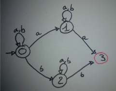
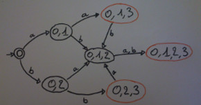
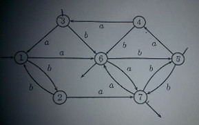
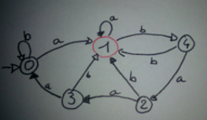
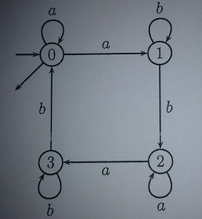
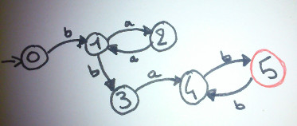

#AF4

### Determinisation :
L'état **Initial** est un état qui possède tous les numéros des états initiaux de l'automate

Les états **finaux** sont les états qui un numéro d'un état final de l'automate

| Etat | a | b |
|:--|:--:|:--:|
| 0 | 0,1 | 0,2 |
| 1 | 1,**3** | 1 |
| 2 | 2 | 2,**3**|
| **3** | **/** | **/** |

 

### Automate Fini Complet Deterministe
### Complémentaire
### Mirroir
### Union
### Inter
### Moore

### Mc Naughton et Yamada
#### Contruire une expression rationnelle à partir d'un automate

* On ajoute a l'automate un état `I` initial auquel on ajoute des epsilon transition vers les états initiaux
  et un état `F` Final ver qui vont pointer tout les états finaux avec des épsilon transitions

  # IMAGE 4

### Équation linéaire droite
#### Contruire une expression rationnelle à partir d'un automate

#### Lemme d'Arden

`L = X.L+Y   =>    L = X*.Y`

**Lautomate doit être deterministe**

`L0 = a.L0 + a.L1 + ε`  
`L1 = b.L1 + b.L2`  
`L2 = a.L2 + a.L3`  
`L3 = b.L3 + b.L0`

**On ne cherche que les états initiaux. S'il y a plusieurs états initiaux on fera l'union**

`L3 = b*.(b.L0)`  Lemme d'Arden

On remplace `L3` dans `L2`  
`L2 = a.L2 + a.b*.(b.L0)`  

Il nous reste donc :  
`L0 = a.L0 + a.L1 + ε`  
`L1 = b.L1 + b.L2`  
`L2 = a.L2 + a.b*.(b.L0)`  

`L2 = a*.a.b*.b.L0` => (Arden)

`L0 = a.L0 + a.L1 + ε`  
`L1 = b.L1 + b.a*.a.b*.b.L0`

`L1 = b*.b.a*.a.b*.b.L0` => (Arden)

`L0 = a.L0 + a.b*.b.a*.a.b*.b.L0 + ε`  
`L0 = (a.+ a.b*.b.a*.a.b*.b).L0 + ε`  

`L0 = (a.+ a.b*.b.a*.a.b*.b)*`  => (Arden)

### Résiduel

`L = b.(a.a)*.b.a.(b.b)*.b`

|État | |Expression|
|:--     |:--|:--|
|0|`L =`|` b.(a.a)*.b.a.(b.b)*.b`|
|**-**|`(a–¹)L =`|`Ø `  |
|1|`(b–¹)L = `|`(a.a)*.b.a.(b.b)*.b `  |
|2|`(ba–¹)L =`|`a.(a.a)*.b.a.(b.b)*.b `|  
|3|`(bb–¹)L =`|`a.(b.b)*.b `|  
|1|`(baa–¹)L = (b–¹)L =`|`(a.a)*.b.a.(b.b)*.b`|
|**-**|`(bab–¹)L =`|`Ø `|
|4|`(bba–¹)L =`|`(b.b)*.b `|  
|**-**|`(bbb–¹)L =`|`Ø `|
|**-**|`(bbaa–¹)L =`|`Ø`|  
|**5**|`(bbab–¹)L =`|`b.(b.b)*.b + ε`|
|**-**|`(bbaba–¹)L =`|`Ø`|  
|4|`(bbabb–¹)L = (bba–¹)L =`|`(b.b)*.b`|

### Thomson
### Glushkov
#### Contruire un AF à partir d'une éxpression rationnelle

ex :
`L = ((a.(a.b)*.b)+(b + a.a))*`

* On remplace chaque lettre par un numéro :
`L = ((α1.(α2.α3)*.α4)+(α5 + α6.α7))*`

* On rempli le tableau au ajoutant la ligne `0` qui sera l'état initial

| Lettre | a         | b      |
|:--     |:--:       |:--:    |
| 0      | α1,α6     | **α5** |
| α1     | α2        | **α4** |
| α2     | **-**     | α3     |
| α3     | α2        | **α4** |
| **α4** | α1,α6     | **α5** |
| **α5** | α1,α6     | **α5** |
| α6     | **α7**    | **-**  |
| **α7** | α1,α6     | **α5** |

* On dessine l'automate de la même maniere que pour la determinisation.

#IMAGE3

### Lemme D'itération
### Critère de cloture
### égalité de deux expressions rationnells
